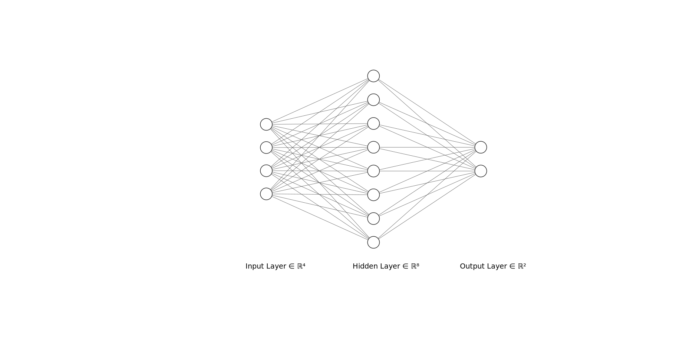
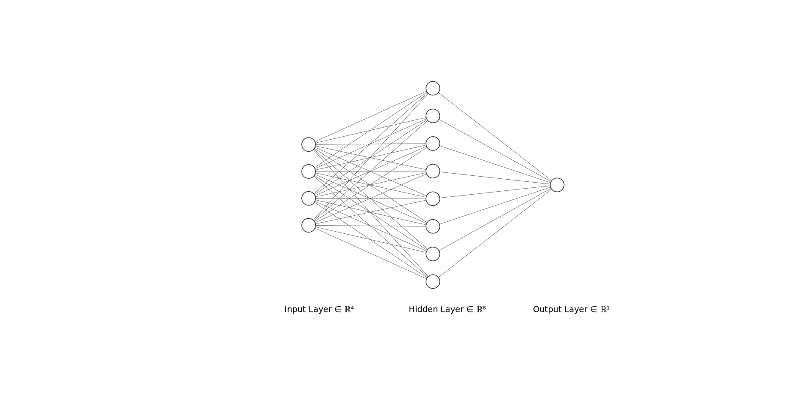

# Actor-Critic RL Project

This repository contains implementations and utilities for reinforcement learning using the Actor-Critic (AC) method. The main focus is on solving the CartPole environment and visualizing signals generated during training.

For documentation:
https://github.com/SujitJustineBarwa/Reinforcement_Learning_Projects/wiki

## Main program

### `cart_pole_AC_code.py`

- Implements the Actor-Critic algorithm for the CartPole-v1 environment (OpenAI Gym).
  
*Figure 1. Actor (policy) network outputs action probabilities via Softmax.*

  
*Figure 2. Critic (value) network estimates V(s) for TD targets and advantage.*
- Trains an agent to balance the pole using policy and value networks.
- Key features:
    - Customizable hyperparameters (learning rate, gamma, etc.).
    ```bash
    discount_factor = 0.95
    actor_optimizer = optim.Adam(actor_model.parameters(), lr=1e-3)
    critic_optimizer = optim.Adam(critic_model.parameters(), lr=1e-2)

    ```
    - Logging of rewards and losses.
```math
\delta = G_t - V(s) = r + \gamma V(s_{t+1}) - V(s_t) \\
L_{actor}(s) = \delta ln(\pi(A_t | s_t)) \\
L_{critic}(s) = \delta^2
```

    - Here, $\delta$ is the advantage function.

    - Model saving and loading functionality.
    ```bash
    def save_model(self, path="critic.pth"):
        """Save model parameters to a file"""
        torch.save(self.state_dict(), path)
        print(f"Critic model saved to {path}")

    def load_model(self, path="critic.pth"):
        """Load model parameters from a file"""
        self.load_state_dict(torch.load(path))
        self.eval()  # set to eval mode
        print(f"Critic model loaded from {path}")
    ```

#### Usage

```bash
python cart_pole_AC_code.py
```

#### Notes
- The reward system has to be set to sutton and burto system.Here, -1 for termination and 0 while not terminated.
    ```bash
    env = gym.make("CartPole-v1", render_mode="human",sutton_barto_reward=True)
    ```
- The actor's learning rate should be lower then critic so that the policy should not change as fast as critic (value of the state).


## Utility program

### `Signal_viewer.py`

- Provides visualization tools for signals (e.g., rewards, losses) generated during training.
- Plots training curves for analysis and debugging.
- Can be used to compare different runs or hyperparameter settings.

## Requirements

- Python 3.7+
- `numpy`
- `matplotlib`
- `gym`
- `torch` (if using PyTorch-based implementation)

Install dependencies:

```bash
pip install -r requirements.txt
```

## Getting Started

1. Train the agent using `cart_pole_AC_code.py`.
2. Visualize the results with `Signal_viewer.py`.

## License

This project is licensed under the MIT License.
